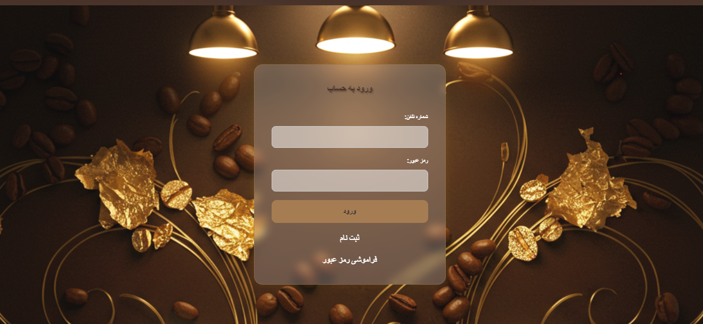
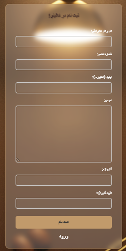
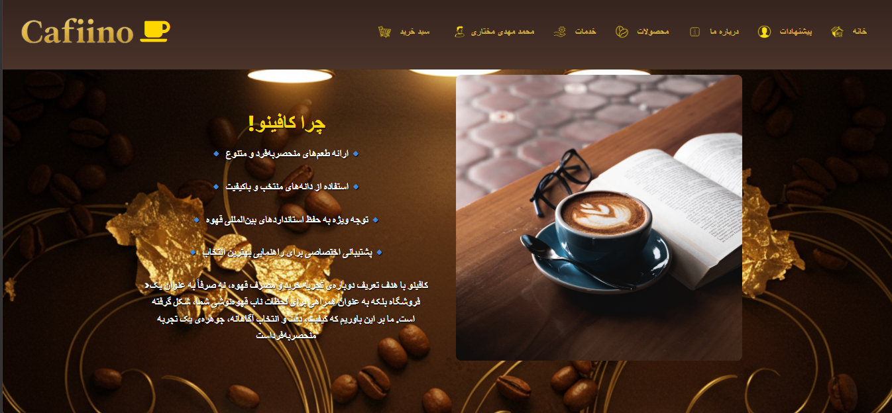
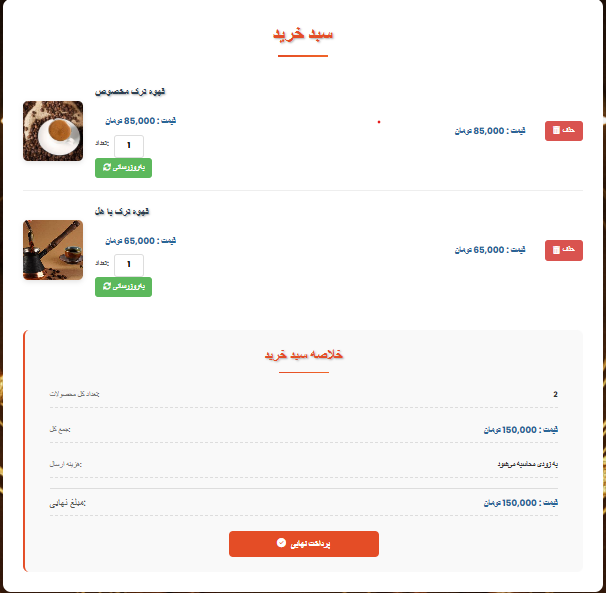
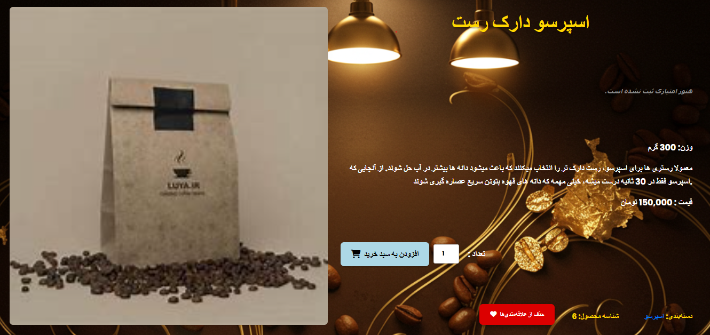
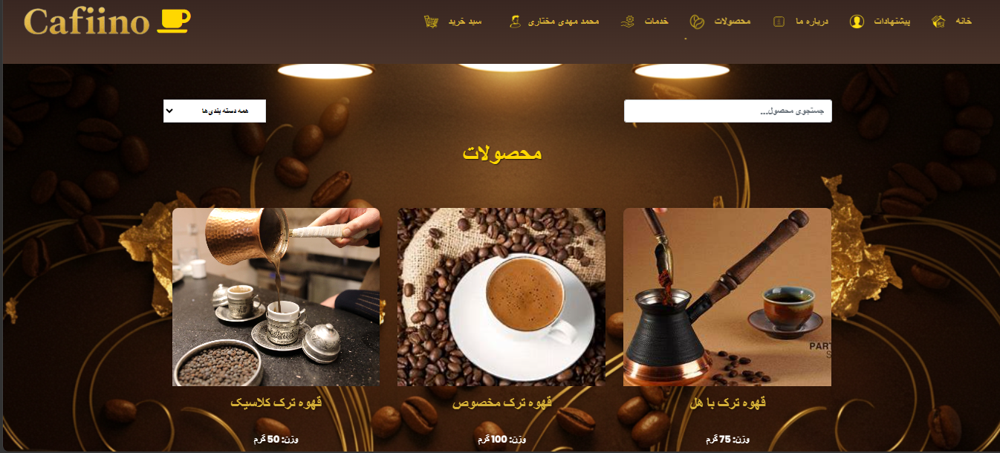
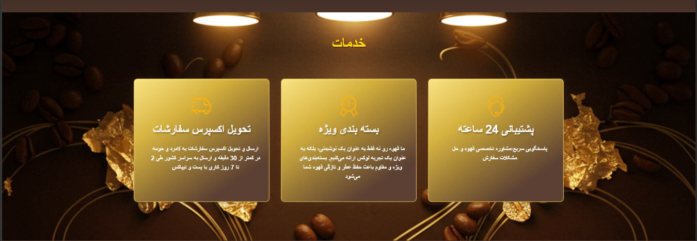

# Project Name

Coffino is one of my earliest Django projects, created as a personal learning and experimentation project. It was built to explore Django fundamentals and practice implementing common web application features. The project simulates a coffee shop management system where users can manage products and orders, while also demonstrating features such as search, filtering, pagination, and role-based permissions.

This repository is intended as a sample project and reflects my early experience with Django development.

## Features

* Search and Filtering


### Backend

* Python
* Django

### Frontend

* HTML
* CSS
* JavaScript


### Database

* sqlite3

## Project Structure

```text
CAFFINO/
│
├── Caffino => main app
├── CaffinoShop => main project
├── images
├── media
├── static
├── STATICS
├── Templates
├── venv
├── .env
├── .gitattributes
├── .gitignore
├── db.sqlite3
├── LiCENSE
└── manage.py
├── README.md
├── requirements.txt
```

---

## Installation

Clone the repository:

```bash
git clone https://github.com/mohammad6206/Caffino.git

```

Install dependencies:

```bash
pip install -r requirements.txt
```

---

## Environment Variables

Create a `.env` file based .

Example:

```env
SECRET_KEY = django-insecure-3r@xb^=4&vwdu10!x2te&$1qr1ar3tl(%5o$!5ua-ml7lp5nn(

DEBUG = True

ALLOWED_HOSTS = [*,127.0.0.1,127.0.0.1:8000]

```

---

## Run Locally

Apply migrations:

```bash
first => python manage.py makemigrations
then => python manage.py migrate
```

Start the server:

```bash
python manage.py runserver
```

---

## Screenshots


### Login Page




### Register Page



### About Page



### Card Page



### ProductDetail Page



### Product



### Services Page



**Your Name**

Full-stack Web Developer | Django & React

GitHub: https://github.com/mohammad6206

LinkedIn: https://www.linkedin.com/in/mohammad-mehdi-mokhtari-0759b6388

